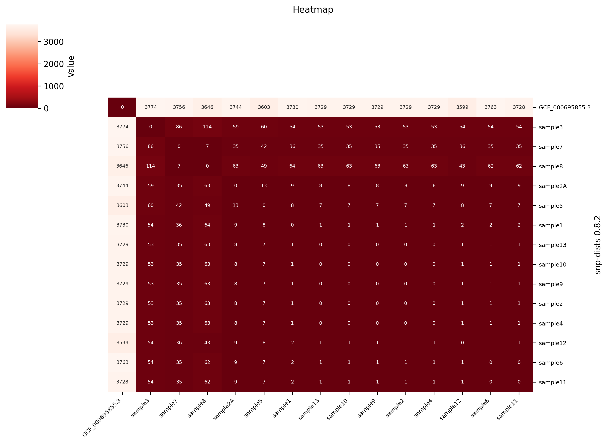
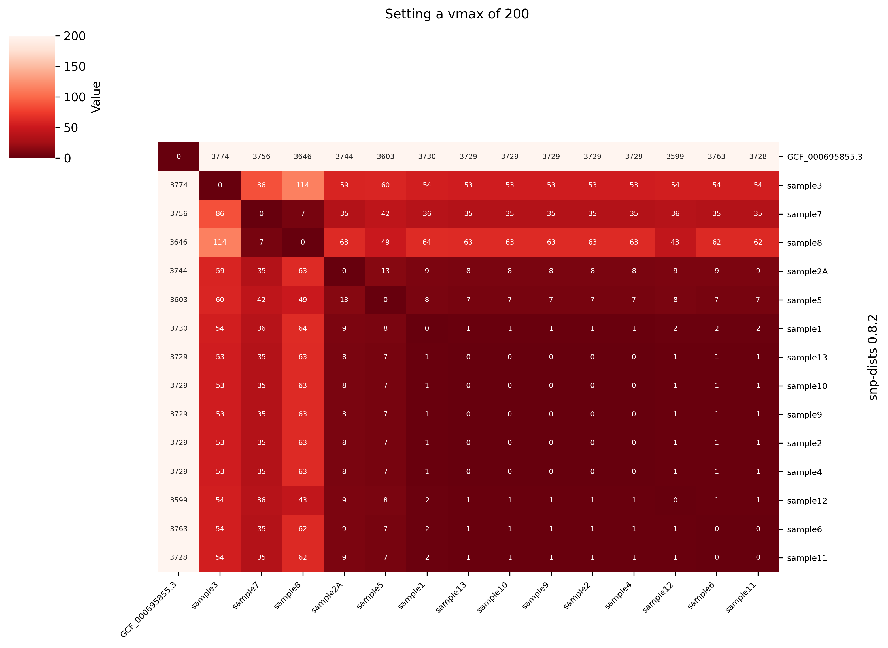
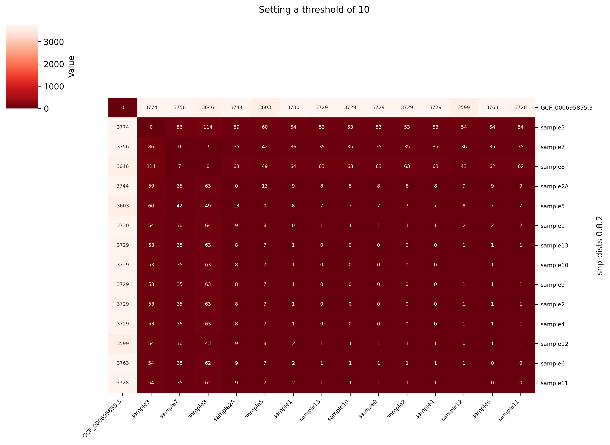
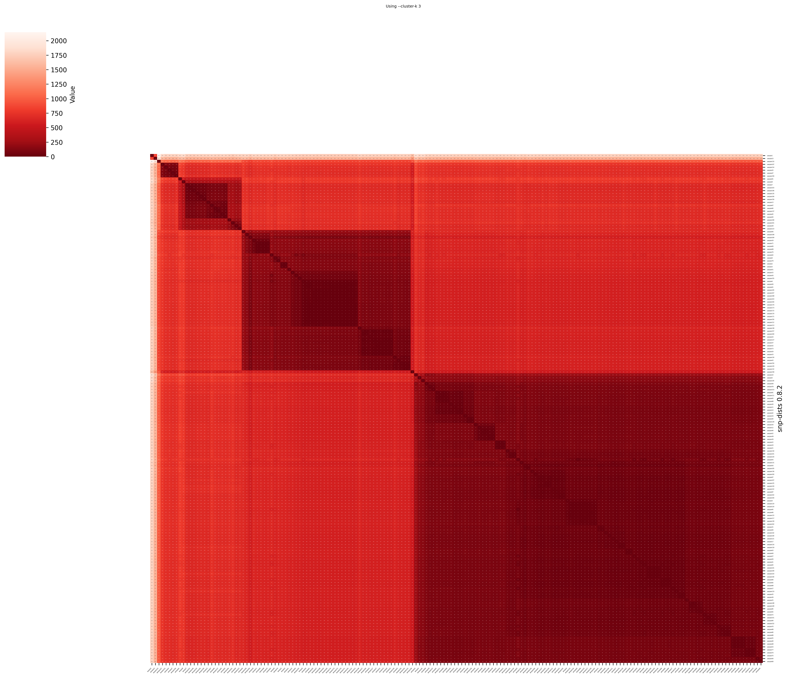
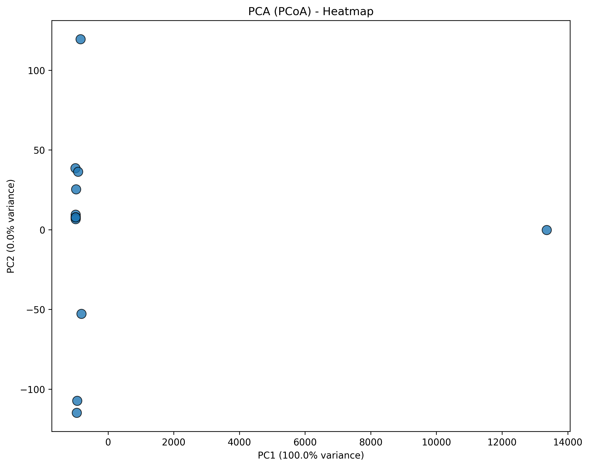
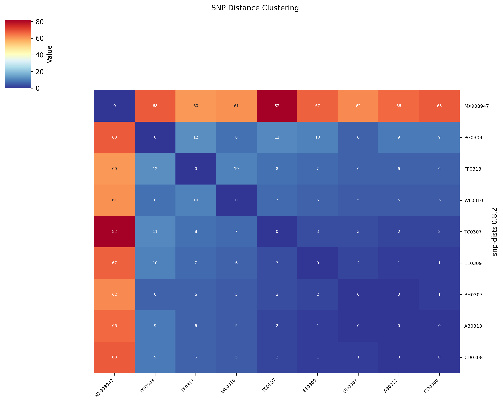
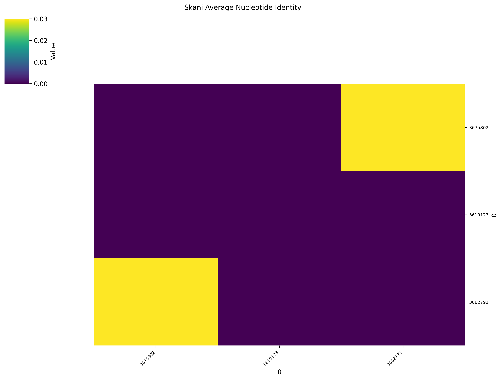
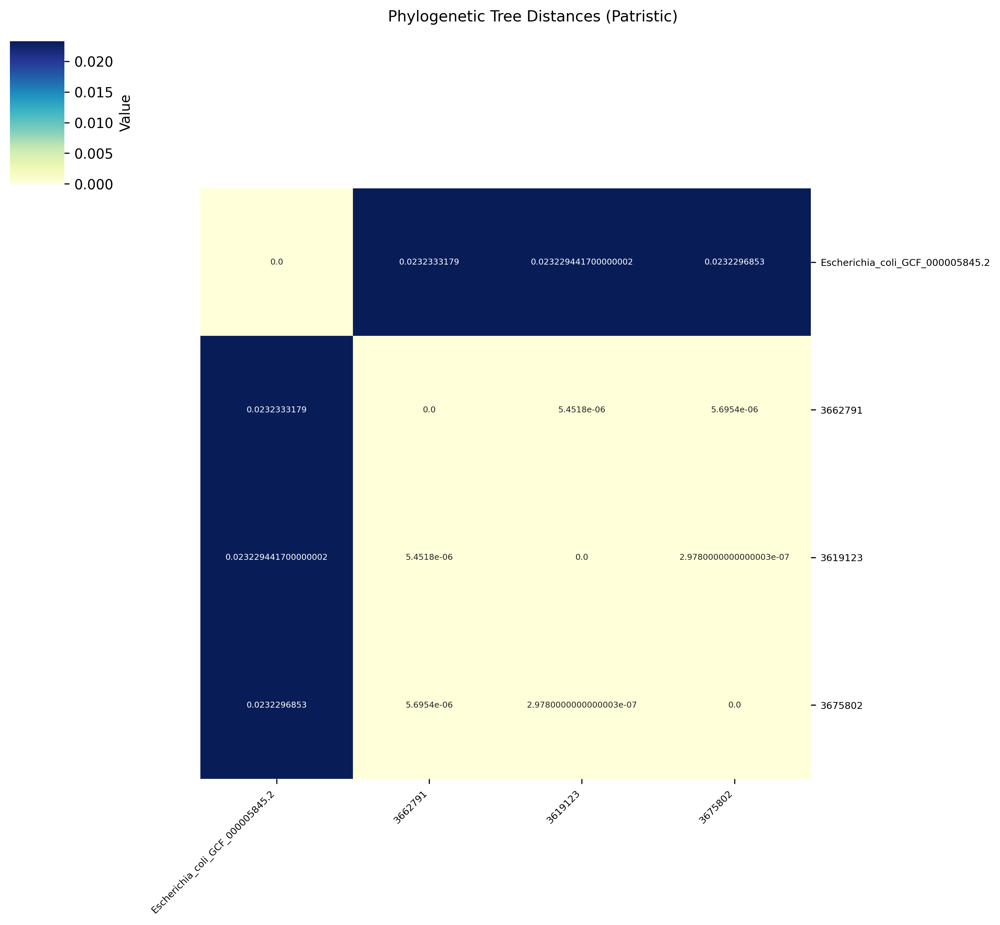
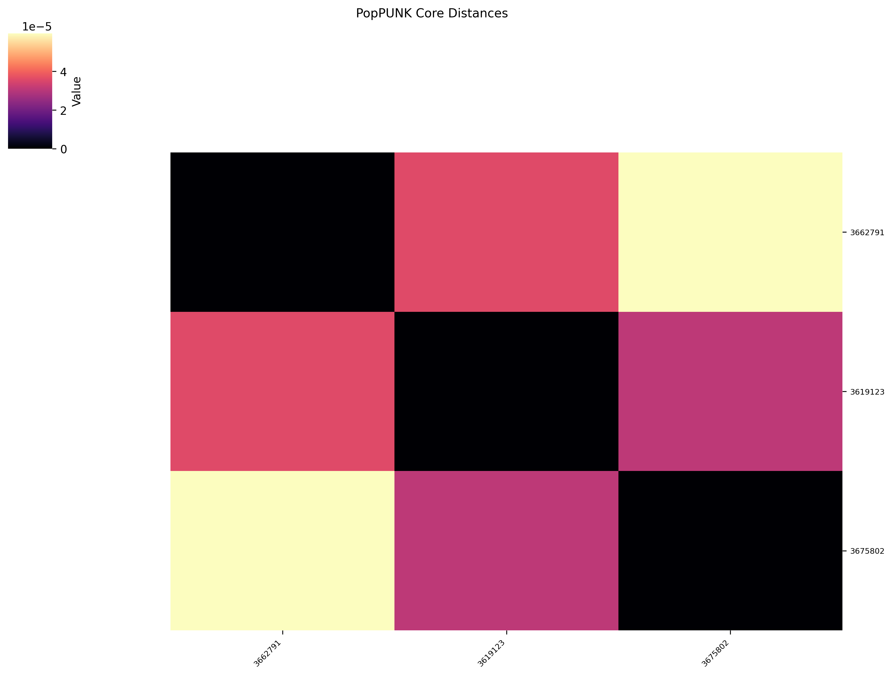

# HeatCluster: Automated Genomic Epidemiology & Visualization

<div align="center">
  
  <h1>HeatCluster</h1>

  
</div>

<br>

**HeatCluster** is a command-line bioinformatics tool designed to bridge the gap between raw genomic distance matrices and actionable epidemiological insights. HeatCluster integrates unsupervised machine learning (Hierarchical Clustering, PCA, Silhouette Analysis) with publication-quality visualization to automatically identify and classify viral or bacterial lineages. 

## Table of Contents
- [Key Features](#key-features)
- [Installation](#installation)
- [Quick Start](#quick-start-examples)
- [Outputs](#outputs)
- [Machine Learning Workflows](#machine-learning-workflows)
- [Visualization Controls](#visualization-controls)
- [Supported Inputs](#supported-input-formats)
- [Citation](#citation)

## Key Features

### Robust Data Ingestion

HeatCluster can import the outputs of other popular bioinformatic tools.

### Machine Learning & Automation

HeatCluster uses common clustering methods.
* **Unsupervised Clustering:** utilizes `fastcluster`, a C++ optimized library, to perform hierarchical clustering. This reduces computational complexity to $O(N^2)$, allowing for rapid processing of large-scale datasets that would choke standard Python implementations.
* **Automated Model Selection (Auto-K):** The tool features an **Auto-K** module that uses **Silhouette Analysis**. This algorithm iteratively tests different cluster counts ($K$) and mathematically determines the optimal number of lineages.
* **Feature Extraction:** Users can flatten hierarchical trees into discrete, exportable clusters (CSV format) using two methods:
  * **K-Means Style:** Dividing the tree into a fixed number of groups.
  * **Biological Thresholds:** defining clusters based on a specific distance metric (e.g., grouping all samples that are less than 10 SNPs apart).
* **Dimensionality Reduction:** Integrates **PCA (Principal Component Analysis)** to generate validation scatter plots. These plots color-code samples based on the heatmap clusters, providing a secondary visual confirmation of the biological structure.

### Publication-Ready Visualization

The visualization engine is built to produce figures that are ready for manuscripts and posters without post-editing.
  * **Dynamic Masking:** Users can hide irrelevant data noise by masking values based on thresholds (e.g., "Mask all samples with <95% ANI" to focus only on species-level matches).
  * **High-DPI Output:** Images can be generated at 300+ DPI, ensuring crisp resolution for print.
  * **Smart Formatting:** The tool automatically scales font sizes and figure dimensions based on the sample count to prevent overlapping text and cluttered visuals.
  
---

## Installation

HeatCluster requires Python 3.8 or higher.

From source:
```bash
git clone https://github.com/DrB-S/heatcluster.git
cd heatcluster
pip install .
```

From pypi:
```bash
pip install heatcluster
```

**Core Dependencies:** `pandas`, `numpy`, `scipy`, `seaborn`, `matplotlib`, `scikit-learn`, `fastcluster`.

---

## Quick Start Examples

### 1. Basic Heatmap (SNP Matrix)

Visualize a standard SNP distance matrix with a reverse-red colormap (where darker red indicates fewer SNPs/closer relation):

```bash
heatcluster -i matrix.csv -o heatmap.png --cmap Reds_r
```

### 2. ANI Visualization (Skani / FastANI)
Visualize Average Nucleotide Identity (ANI) using the skani format and a sequential colormap like viridis:

```bash
heatcluster -i skani_results.txt --format skani --cmap viridis -o ani_plot.png
```

### 3. Pipeline Analysis (No Plot)

Automatically detect clusters and export them to CSV without generating an image (useful for large datasets or pipelines):

```bash
heatcluster -i large_matrix.csv --auto-k --no-plot -l clusters.csv
```

## Outputs
HeatCluster generates the following files:
* **`heatcluster_matrix.png`** (Default): The high-resolution clustered heatmap.
* **`heatcluster_sorted.csv`** (Default): The input distance matrix re-ordered to match the clustering tree. Useful for aligning metadata.
* **`heatcluster_clusters.csv`** (Optional): Created when using `--auto-k`, `--cluster-k`, or `--cluster-t`. Contains two columns: `Sample` and `Cluster_ID`.
* **`heatcluster_pca.png`** (Optional): The validation scatter plot created when `--pca` is used.

---

## Machine Learning Workflows

### Automated Lineage Discovery (Auto-K)

**Use Case:** Exploratory analysis of a new dataset where the population structure is unknown (e.g., initial screening of a hospital database).

If the number of outbreaks in the data is unknown, the **Silhouette Analysis** engine can determine it automatically.

```bash
heatcluster -i large_matrix.csv \
  --auto-k \
  --cluster-out clusters.csv \
  --pca --pca-out pca_plot.png
```

* **--auto-k:** Iteratively tests $K=2..10$ and selects the cluster count with the highest Silhouette Coefficient. This mathematically identifies the most distinct natural groupings in the data.
* **--cluster-out:** Saves the specific samples belonging to each lineage to `clusters.csv`.
* **--pca:** Generates a validation scatter plot colored by the detected clusters. This provides a secondary visual check to ensure the detected clusters actually form distinct groups in principal component space.

> **A Note on Automated Clustering**
> 
> The **Auto-K (Silhouette Analysis)** and **PCA** validation modules included in HeatCluster demonstrate how unsupervised machine learning techniques can be applied to genomic epidemiology.
> 
> While these methods are mathematically robust for identifying structure in high-dimensional data, they are not yet standard practice in clinical bioinformatics. Most outbreak detection currently relies on fixed biological thresholds (e.g., SNP cutoffs) rather than dynamic clustering coefficients.
> 
> These features are provided as **experimental tools** for exploratory analysis and to demonstrate the potential of integrating Scikit-learn workflows into genomic surveillance. Users should always validate "automated" clusters against biological context and established epidemiological links.

### Threshold-Based Surveillance

**Use Case:** Routine public health surveillance where "_outbreak_" is defined by a strict biological rule (e.g., CDC guidelines defining a cluster as isolates within 50 SNPs).

To define an outbreak strictly as "any cluster of samples separated by fewer than 50 SNPs":

```bash
heatcluster -i snp_matrix.csv \
  --cluster-t 50 \
  --cluster-out outbreaks.csv
```

### Outlier Detection & Manual Override

**Use Case:** Refining analysis when automated metrics are skewed by a single distant outlier (e.g., one sample is 10,000 SNPs away, forcing all other distinct outbreaks into a single "cluster").

If automated metrics fail due to global outliers, specific cluster counts can be enforced based on visual inspection of the heatmap or dendrogram.

```bash
heatcluster -i matrix.csv --cluster-k 4 --cluster-out manual_clusters.csv
```
---

## Visualization Controls 
| Flag | Description | Example |
| :--- | :--- | :---: |
| `--title`| Set a custom plot title| `--title "Salmonella Outbreak 2024"` |
| `--cmap` | Set the matplotlib colormap | `--cmap viridis` |
| `--no-annot`| Hide numbers inside cells (clean look)| `--no-annot`|
| `--no-plot` | Skip image generation (CSV/Analysis only) | `--no-plot` |
| `--dendrogram` | Show the hierarchical tree structure | `--dendrogram` |
| `--no-cluster` | Disable clustering (simple sorting only) | `--no-cluster` |
| `--dpi`| Set image resolution| `--dpi 300`|
| `--hide-below`| Mask values lower than X| `--hide-below 95.0`|
| `--hide-above`| Mask values higher than X| `--hide-above 50` |
| `--vmin` / `--vmax` | Force min/max values for color scale | `--vmin 0 --vmax 100` |
| `--width` / `--height`| Force figure dimensions (inches)| `--width 12 --height 12`|
| `--font-scale` | Scale text size by a factor | `--font-scale 1.5` |

---

## Supported Input Formats

HeatCluster accepts a wide variety of inputs from standard bioinformatics tools. Use the `--format` flag to specify the input type. 

A sample file from each analysis can be found in the repository in [test](./test/).

A list of general sample commands that were used to generate each test file can be found in [docs](./docs/README.md).

### Important: Distance vs. Identity
HeatCluster requires a **Distance Matrix** (where `0` = Identical).
If an **Identity** or **Similarity** matrix (where `100` or `1.0` = Identical) is provided, HeatCluster will **automatically invert** the values.

| Format | Automatic Conversion Applied |
| :--- | :--- |
| **FastANI, Skani, EzAAI** | `Distance = 100.0 - Identity` |
| **Sourmash, PyANI (Id), Dashing** | `Distance = 1.0 - Similarity` |

---

### Genomic Identity (ANI / AAI)
* **FastANI** (`--format fastani`)
  Parses the standard 5-column tab-delimited output (`query`, `ref`, `ANI`, `frag_map`, `total_frag`).
* **Skani** (`--format skani`)
  Supports `skani triangle` outputs.
* **EzAAI** (`--format ezaai`)
  Parses the summary file (Label 1, Label 2, AAI/ANI).
* **Sourmash** (`--format sourmash`)
  Parses standard CSV comparison matrices.
* **PyANI**
  * `--format pyani_identity`: Parses percent identity matrices (inverts 1.0 -> 0.0).
  * `--format pyani_errors`: Parses the similarity error count matrix (mismatches/gaps).

### SNP & Variant Calling
* **SNP-dists** (`--format snp-dists`)
  *Default.* Expects a standard square CSV/TSV matrix.
* **VCF / VCF.gz** (`--format vcf`)
  Calculates **Manhattan Distance** between samples using a ploidy-agnostic dosage approach (Compatible with both Haploid and Diploid organisms).
  * *Note:* Strictly filters for biallelic sites to ensure accurate distance counts.
* **NCBI Pathogen Detection** (`--format pathogen_detection`)
  Parses the `reference_target.SNP_distances.tsv` file using the biosample accession for naming. Fills missing pairs with the maximum observed distance.
* **SKA** (`--format ska`)
  Parses the pairwise distance output from Split K-mer Analysis.

### Gene Content & Allele Calling (MLST)
* **Roary / Panaroo** (`--format gene_presence_absence`)
  Parses the `gene_presence_absence.Rtab` binary matrix.
  * *Metric:* Calculates **Jaccard Distance** (0.0 = Identical gene content).

### Sketching & K-mer Distance
* **Mash** (`--format mash`)
  Parses the standard 5-column list output.
* **Dashing** (`--format dashing`)
  Parses asymmetric distance matrices.
* **BinDash** (`--format bindash`)
  Parses the 5-column TSV output.
* **KWIP** (`--format kwip`)
  Parses the weighted inner-product matrix.

### Phylogeny & Clusters
* **Newick Trees** (`--format nwk`)
  Calculates the **Patristic Distance** (sum of branch lengths) between all tips in the tree. Requires `biopython`.
* **IQ-TREE** (`--format iqtree`)
  Parses the `.mldist` file (Phylip format square matrix) generated by IQ-TREE.
* **PopPUNK** (`--format poppunk`)
  Parses the `.dists.npy` and companion `.pkl` files directly.

### Generic Data
* **Melted / Long-Format** (`--format melted`)
  - Accepts any generic 3-column CSV/TSV list: `SampleA`, `SampleB`, `Value`.
  - Does not have a header line.
  - This is useful for custom metrics. 
  - There is a row for sample-sample comparison. 
  - The value of 0 must be used for identical, and the remaining values are positive.

Example:
```
A B 1
B A 1
B B 0
A A 0
```
---
## Gallery & Examples

### Visualization Controls
HeatCluster gives you fine-grained control over how your data is displayed.

| Default View | Custom Color Scale | Threshold Clustering |
| :---: | :---: | :---: |
| **Standard Output** | **`--vmax 200`** | **`--cluster-t 10`** |
|  |  |  |
| *Standard hierarchical clustering* | *Adjusting contrast for high-variance data* | *Defining clusters by distance < 10* |

---

### Machine Learning & Validation
Automate the discovery of lineages or validate your clusters with PCA.

| Manual K-Means | Auto-K (Silhouette Analysis) | PCA Validation |
| :---: | :---: | :---: |
| **`--cluster-k 3`** | **`--auto-k`** | **`--pca`** |
|  |  |  |
| *Forcing 3 specific lineages* | *Automatically detecting optimal clusters* | *Dimensionality reduction check* |

---

### Supported Input Formats
HeatCluster natively handles diverse genomic data types.

#### Genomic Identity (ANI) & SNP Matrices
| SNP Distance | Average Nucleotide Identity |
| :---: | :---: |
| **SNP-dists** | **Skani / FastANI** |
|  |  |
| *Diverging colormap (`RdYlBu_r`)* | *Sequential colormap (`viridis`) inverted* |

#### Phylogenetics & K-mer Sketching
| Phylogenetic Tree | PopPUNK Distances |
| :---: | :---: |
| **Newick (.nwk)** | **PopPUNK (.npy)** |
|  |  |
| *Patristic distance from tree topology* | *Binary matrix visualization* |

---


## Citation
If you use HeatCluster in your research, please cite:
> **HeatCluster: Automated Genomic Epidemiology & Visualization.** [https://github.com/DrB-S/heatcluster](https://github.com/DrB-S/heatcluster)

## Contributing
Contributions are welcome! Please submit issues for bug reports or feature requests. Pull requests are appreciated for new parsers or plotting features.

## License
MIT License. Free for academic and commercial use.
